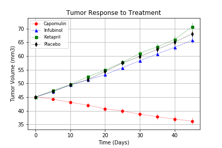
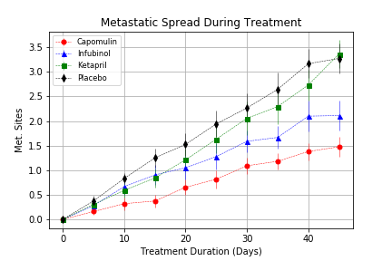
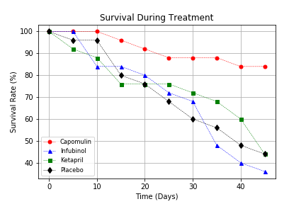
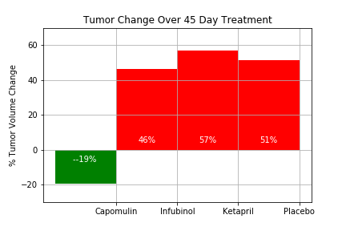

# Pharmaceuticals-Analysis-Python

The objective is to analyze the data to show how four treatments (Capomulin, Infubinol, Ketapril, and Placebo) compare.

- Created a scatter plot that shows how the tumor volume changes over time for each treatment.
- Created a scatter plot that shows how the number of metastatic (cancer spreading) sites changes over time for each treatment.
- Created a scatter plot that shows the number of mice still alive through the course of treatment (Survival Rate)
- Created a bar graph that compares the total % tumor volume change for each drug across the full 45 days.

### Tumor response to treatment 

### Metastatic spread during treatment

### Survival during treatment 

### Tumor change over 45 day treatment 

